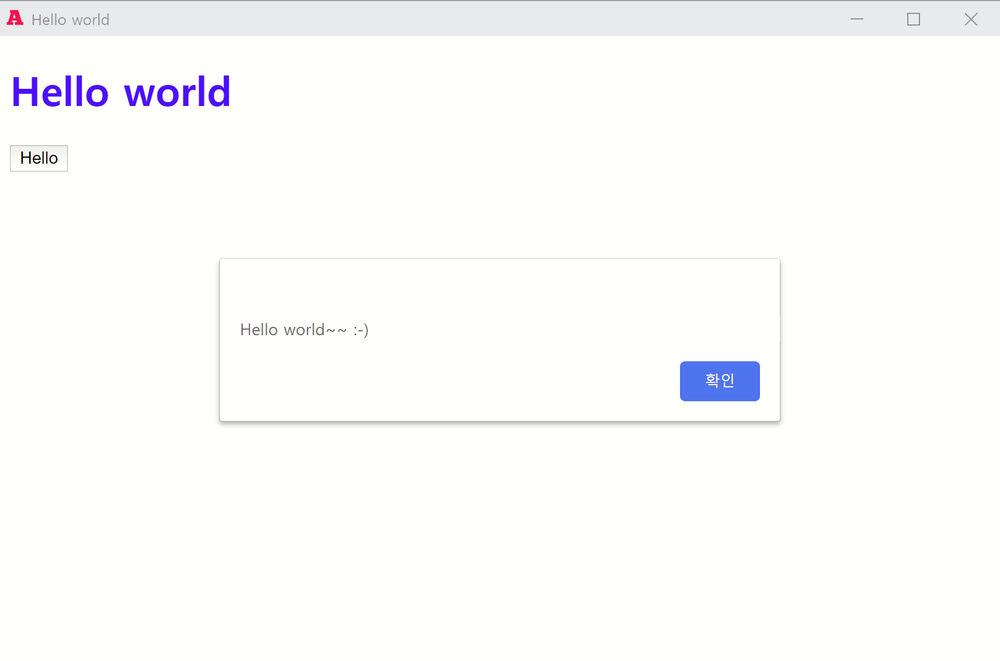
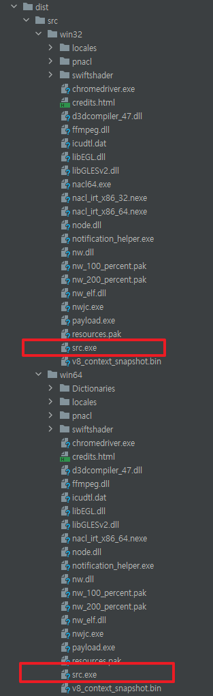

Use your web application as a desktop application with NW.js

# step-1

```
$ npm init -y
$ npm install nw@0.44.1-sdk nw-builder --save-dev
```

# step-2

modify package.json

```
{
  ...
  "scripts": {
    "dev": "nw src/",
    "prod": "nwbuild --platforms win32,win64 --buildDir dist/ src/"
  },

  ... Below are automatically added  
  "devDependencies": {
    "nw": "^0.44.1-sdk",
    "nw-builder": "^3.5.7"
  }
}
```

# step-3

```
$ mkdir src
$ cd src
$ npm init -y
```

# step-4

* modify entry-point
* ref: [nw.js manifest-format](https://github.com/nwjs/nw.js/wiki/manifest-format)

modify src/package.json 

```
...
"main": "views/main.html"

"window": {
    "title": "Breakout",
    "icon": "assets/icon.png",
    "toolbar": true,
    "width": 800,
    "height": 500,
    "min_width": 400,
    "min_height": 200,
    "max_width": 800,
    "max_height": 600,
    "position": "mouse"
}
...

```

# step-5

```
$ mkdir assets
$ mkdir styles
```

src/index.html file creation

```html
<!DOCTYPE html>
<html lang="en">
<head>
    <meta charset="UTF-8" />
    <meta name="viewport" content=""width="device-width, intial-scale=1.0" />
    <meta http-equiv="X-UA-Compatible" content="ie=edge" />
    <link rel="stylesheet" href="../styles/style.css" />
    <title>Hello world</title>
</head>
<body>
<h1>Hello world</h1>

<button onclick="hello()">Hello</button>

<script src="index.js"></script>
</body>
</html>
```

src/styles/style.css file creation

```
h1 {
    color: blue;
}
```

src/index.js file creation

```
function hello() {
    alert('Hello world~~ :-)');
}
```

prepare src/assets/icon.png file

# step-6

```
$ npm run dev
```



# step-7

build prod 

```
$ npm run prod
```

 

enjoy src.exe. :-)

